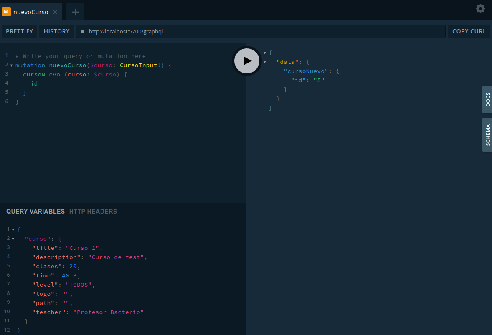

# Api Academia Online

1. [Creación y configuración de ficheros necesarios](#config)
2. [Instalación de dependencias](#dependencies)
3. [Ficheros JSON con la información de cursos](#course-info)
4. [Creación del servidor node express](#express)
5. [Schema](#schema)
6. [Resolvers](#resolvers)
7. [Configurar Apollo Server](#apollo)
8. [Obtener la lista de estudiantes](#students)
9. [Obtener un estudiante con el id indicado](#one-student)
10. [Obtener la lista de cursos](#courses)
11. [Obtener un curso con el id indicado](#one-course)
12. [Lista de estudiantes de los cursos](#students-from-course)
13. [Mutations: Primeros pasos](#mutations)
14. [Definición del input CursoInput](#input)
15. [Añadir un nuevo curso](#new-course)
16. [Validaciones para no duplicar datos](#validations)
17. [Modificar un curso](#modify-course)
18. [Eliminar un curso](#delete-course)

## 1. Creación y configuración de ficheros necesarios

Generamos el *package.json* mediante 
~~~
npm init
~~~

Generamos el *tsconfig.json* mediante 
~~~
npx tsc --init --rootDir src --outDir build --lib dom,es6 --module commonjs --target es6 --removeComments --resolveJsonModule true
~~~

## 2. Instalación de dependencias

Lista de dependencias que necesitaremos para trabajar en este proyecto:
- [express](https://www.npmjs.com/package/express)
- [apollo-server-express](https://www.npmjs.com/package/apollo-server-express)
- [lodash](https://www.npmjs.com/package/lodash)
- [graphql](https://www.npmjs.com/package/graphql)
- [graphql-import-node](https://www.npmjs.com/package/graphql-import-node)
- [compression](https://www.npmjs.com/package/compression)
- [cors](https://www.npmjs.com/package/cors)
- [typescript](https://www.npmjs.com/package/typescript)
- [graphql-tools](https://www.npmjs.com/package/graphql-tools)
- [graphql-playground-middleware-express](https://www.npmjs.com/package/graphql-playground-middleware-express)

### Dependencias de producción:
~~~
npm install express graphql ncp http graphql-import-node compression cors lodash typescript graphql-tools graphql-playground-middleware-express apollo-server-express
~~~

### Dependencias de desarrollo:
~~~
npm install @types/compression @types/express @types/cors @types/lodash @types/node @types/graphql -D
~~~

## 3. Ficheros JSON con la información de cursos

Creamos la carpeta *src* y dentro de ella otra carpeta *data* donde pondremos los archivos JSON con los datos.

Creamos un archivo *data.store.ts* para importar los JSON.

~~~
import cursos from './courses.json';
import estudiantes from './students.json';

export const database = {
  cursos,
  estudiantes
}
~~~

## 4. Creación del servidor node express

Configuramos los scripts del *package.json*

~~~
  "scripts": {
    "start": "node build/server.js",
    "build": "tsc -p . && ncp src/shchema build/schema",
    "start:dev": "npm run build:dev",
    "build:dev": "nodemon 'src/server.ts' --exec 'ts-node' src/server.ts -e ts,json,graphql"
  },
~~~

Configuramos el servidor node express con los parámetros básicos

~~~
import compression from 'compression';
import cors from 'cors';
import { createServer } from 'http';

const PORT = 5200;
const app = express();

app.use(cors());
app.use(compression());
app.get('/', (req, res) => res.send('Hola a la academia online en GraphQL'));

createServer(app).listen(
  { port: PORT },
  () => console.log(`Servidor Academia Online listo http://localhost:${PORT}`)
);
~~~

## 5. Schema

Creamos un directorio *schema* dentro de *src* y en su interior el archivo *schema.graphql* en el que definiremos los tipos que vamos a necesitar en función de los datos que tenemos:

~~~
type Query {
  estudiantes: String
}

type Estudiante {
  id: ID!
  name: String!
  email: String!
  website: String
  courses: [Curso!]!
}

type Curso {
  id: ID!
  title: String!
  description: String
  clases: Int!
  time: Float
  level: Nivel
  logo: String!
  path: String!
  teacher: String!
  students: [Estudiante!]
  reviews: [Valoracion!]!
}

enum Nivel{
  TODOS
  NOVATOS
  INTERMEDIO
  EXPERTO
}

type Valoracion {
  id: ID!
  name: String!
  points: Float!
  comment: String
}
~~~

## 6. Resolvers

Creamos una carpeta *resolvers* en *src* con los siguientes archivos:

~~~
\\query.ts
import { IResolvers } from 'graphql-tools';

const query: IResolvers = {
  Query: {
    estudiantes(): string {
      return "lista de estudiantes"; //sólo para testear
    }
  }
}

export default query;
~~~

~~~
\\resolversMap.ts
import { IResolvers } from 'graphql-tools';
import query from './query';

const resolversMap: IResolvers = {
  ...query
}

export default resolversMap;
~~~

En la carpeta *src/schema* creamos un archivo *index.ts* que contendrá lo siguiente:

~~~
import { GraphQLSchema } from 'graphql';
import 'graphql-import-node';
import { makeExecutableSchema } from 'graphql-tools';
import typeDefs from './schema.graphql';
import resolvers from '../resolvers/resolversMap';

const schema: GraphQLSchema = makeExecutableSchema({
  typeDefs,
  resolvers
})

export default schema;
~~~

## 7. Configurar Apollo Server

Modificamos *server.ts*

~~~
...
import { ApolloServer } from 'apollo-server-express';
import schema from './schema/index';
import expressPlayGround from 'graphql-playground-middleware-express';
...

...
const server = new ApolloServer ({
  schema,
  introspection: true
});

server.applyMiddleware({app});

app.get('/', expressPlayGround({
  endpoint: '/graphql'
}));

createServer(app).listen(
  { port: PORT },
  () => console.log(`Servidor Academia Online listo http://localhost:${PORT}`)
);
...
~~~

## 8. Resolvers - Queries - Lista de estudiantes

Modificamos en *schema.graphql* la query:

~~~
type Query {
  "Lista de los estudiantes de la academia"
  estudiantes: [Estudiante!]!
}
~~~

Igualmente modificamos en *resolvers/query.ts* la constante **query**:

~~~
const query: IResolvers = {
  Query: {
    estudiantes(): any {
      return database.estudiantes;
    }
  }
}
~~~

Una vez hecho esto, ya podemos lanzar en apollo server la query a estudiantes estableciendo los parámetros que queremos que nos devuelva.

Para el caso de querer recuperar la información de los cursos de cada estudiante necesitaremos otro resolver.

Creamos en la carpeta *resolvers* un nuevo archivo *types.ts*:

~~~
import { IResolvers } from 'graphql-tools';
import { database } from '../data/data.store';
import _ from 'lodash';

const type: IResolvers = {
  Estudiante: {
    courses: parent => {
      const cursosLista: any[] = []
      parent.courses.map((curso: string) => {
        cursosLista.push(_.find(database.cursos, ['id', curso]))
      })
      return cursosLista
    }
  }
}

export default type;
~~~

Debemos añadir el nuevo resolver a *resolvers/resolverMap.ts*

~~~
...
  import type from './type';

  const resolversMap: IResolvers = {
    ...query,
    ...type
  }
...
~~~

## 9. Resolvers - Queries - Un estudiante

Primero modificamos *schema.graphql* para añadir la query de un solo estudiante:

~~~
type Query {
  "Lista de los estudiantes de la academia"
  estudiantes: [Estudiante!]!,
  "Información del estudiante de la academia seleccionado por ID"
  estudiante(id: ID!): Estudiante!!,
}
~~~

Luego añadimos el nuevo resolver para obtener un solo estudiante a *resolvers/query.ts*:

~~~
const query: IResolvers = {
  Query: {
    estudiantes(): any {
      return database.estudiantes;
    },
    estudiante(__: void, { id }): any {
      return database.estudiantes.find( estudiante => estudiante.id === id );
    }
  }
}
~~~

Con esto ya tenemos disponible la info en la api.

En caso de que el elemento que buscamos no se encuentre, podemos devolver una respuesta que mantenga el formato que se espera, pero que indique de forma clara que no se han encontrado registros. Para conseguirlo, modificamos el resolver:

~~~
...
  estudiante(__: void, { id }): any {
    const found = database.estudiantes.find( estudiante => estudiante.id === id );
    return found || {
      id: -1, 
      name: `No se ha encontrado el estudiante con ID ${id}`,
      email: '',
      courses: []
    }
  }
...
~~~

## 10. Obtener la lista de cursos

Prodedemos de igual forma que hicimos para la lista de estudiantes: Primero modificamos la query en el schema.

~~~
type Query {
  "Lista de los estudiantes de la academia"
  estudiantes: [Estudiante!]!,
  "Información del estudiante de la academia seleccionado por ID"
  estudiante(id: ID!): Estudiante!,
  "Lista de los cursos de la academia"
  cursos: [Curso!]!
}
~~~

Luego modificamos el resolver en *query.ts*:

~~~
const query: IResolvers = {
  Query: {
  ...
    cursos(): any {
      return database.cursos;
    },
  ...
~~~

## 11. Obtener un curso con el id indicado

Procedemos de la misma forma, modificando primero el schema:

~~~
type Query {
  ...
  "Información del curso de la academia seleccionado por ID"
  curso(id: ID!): Curso!,
}
~~~

Luego modificamos el resolver:

~~~
const query: IResolvers = {
  Query: {
    ...
    curso(__: void, { id }): any {
      const found = database.cursos.find( curso => curso.id === id );
      return found || {
        id: -1,
        title: `No se ha encontrado el curso con ID ${id}`,
        clases: -1,
        logo: '',
        path: '',
        teacher: '',
        reviews: []
      }
    },
  }
}
~~~

## 12. Lista de estudiantes de los cursos

Vamos también a añadir un nuevo resolver para poder obtener los estudiantes que están inscritos a un curso. Para ello modificamos *resolvers/type.ts*:

~~~
const type: IResolvers = {
  ...
Curso: {
    students: parent => {
      const estudiantesLista: any[] = []
      database.estudiantes.map( (estudiante: any) => {
        if (!!estudiante.courses.find( (course: string) => course === parent.id)) {
          estudiantesLista.push(estudiante)
        }
      });
      return estudiantesLista
    },
    path: parent => `http://www.udemy.com${parent.path}`  }
~~~

Como en este caso, los estudiantes de un curso no es un parámetro obligatorio, contemplamos el caso en el que parent.students sea undefined.

Adicionalmente hemos modificado cómo se entrega la información del path del curso para incluir la url completa:

## 13. Mutations: primeros pasos

Una vez hemos terminado de configurar las **queries** para obtener datos, vamos a empezar a configurar los **mutations** para poder añadir nuevos datos.

En *schema-graphql* añadimos un nuevo tipo:

~~~
type Mutation {
  "Añadir nuevo curso del al academia"
  cursoNuevo(curso: CursoInput!): Curso!
  "Modificar curso del al academia existente"
  modificarCurso(curso: CursoInput!): Curso!
  "Eliminar curso del al academia seleccionado por su ID"
  eliminarCurso(id: ID!): Curso!
}
~~~

En el directorio *resolvers* creamos un nuevo fichero *mutation.ts* donde definiremos las distintas acciones más adelante.

~~~
import { IResolvers } from 'graphql-tools';
import _ from 'lodash';

const mutation: IResolvers = {

}

export default mutation;
~~~

Debemos añadir este archivo al *resolversMap.ts*

~~~
const resolversMap: IResolvers = {
  ...query,
  ...type,
  ...mutation,
}
~~~

## 15. Definición del input CursoInput

En el punto anterior indicamos que el parámetor curso para añadir/modificar un curso era del tipo CursoInput.

Definimos este tipo en *schema.graphql* tomando como referencia las propiedades del type *Curso*:

~~~
input CursoInput {
  id: ID
  title: String!
  description: String
  clases: Int!
  time: Float
  level: Nivel
  logo: String!
  path: String!
  teacher: String!
}
~~~

En este caso ID no puede ser required porque al crear el curso no tenemos su valor y va como null. Del mismo modo, no incluimos los atributos reviews ni students porque al crear un nuevo curso estas propiedades no existen.

## 15. Añadir un nuevo curso

En el archivo *mutation.ts* añadimos el mutation para añadir un nuevo curso:

~~~
  Mutation: {
    cursoNuevo(__: void, { curso }): any {
      const nuevoCurso = {
        id: String(database.cursos.length + 1),
        title: curso.title,
        description: curso.description,
        clases: curso.clases, 
        time: curso.time, 
        level: curso.level,
        logo: curso.logo, 
        path: curso.path,
        teacher: curso.teacher, 
        reviews: [],
        students: []
      };
      database.cursos.push(nuevoCurso);
      return nuevoCurso;
    }
  }
~~~

Una vez hecho esto, ya podemos añadir un nuevo curso a través de apollo server:

## 16. Validaciones para no duplicar datos

Para realizar esta validación, en el mutation ponemos una condición que compruebe que el nuevo curso no existe antes de formar el objeto nuevoCurso:

~~~
  if (database.cursos.find( item => curso.title === item.title)) {
    return {
      id: -1,
      title: 'El curso ya existe con este título',
      clases: 0, 
      logo: '', 
      path: '',
      teacher: '',
      reviews: [],
    }
  }
~~~

## 17. Modificar un curso

Creamos el nuevo mutation:

~~~
modificarCurso(__: void, { curso }): any {
  const foundIndex = _.findIndex(database.cursos, item => curso.id === item.id)
  if (foundIndex > 0) {
    database.cursos[foundIndex] = { ...database.cursos[0], ...curso };
    return database.cursos[foundIndex];
  }

  return {
    id: -1,
    title: 'No existe curso con este id',
    clases: 0, 
    logo: '', 
    path: '',
    teacher: '',
    reviews: [],
  }
}
~~~

## 18. Eliminar un curso

Creamos el nuevo mutation:

~~~
    eliminarCurso(__: void, { id }): any {
      const found = _.remove(database.cursos, item => id === item.id)
      return found[0] || {
        id: -1,
        title: 'No existe curso con este id',
        clases: 0, 
        logo: '', 
        path: '',
        teacher: '',
        reviews: [],
      }
    }
~~~